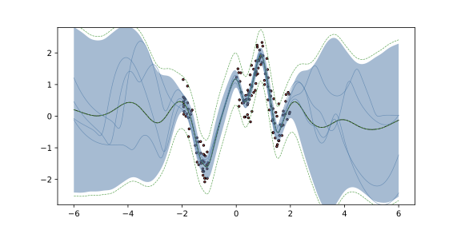
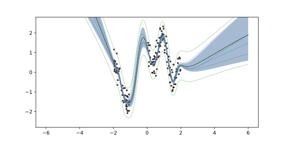
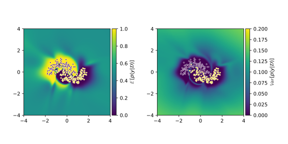
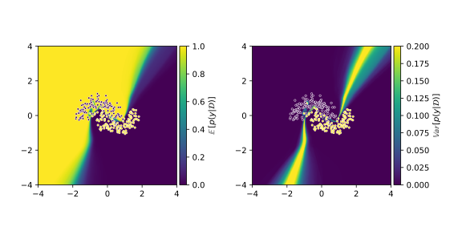

# Experiments

## 1D Regression
```bash
JAX_ENABLE_X64=1 poetry run python experiments/scripts/regression1d.py
```

```bash
trainer/loss_fn=nll net=mcdropout_mlp
```


## 2D Classification
```bash
JAX_ENABLE_X64=1 poetry run python experiments/scripts/classification2d.py
```

```bash
trainer/loss_fn=nll net=mcdropout_mlp
```


## OOD Image Classification
### MNIST/FashionMNIST
```bash
JAX_ENABLE_X64=1 poetry run python experiments/scripts/mnist_ood.py -m net.key.seed=0,1,2,3,4,5,6,7,8,9
```