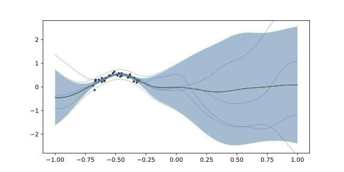
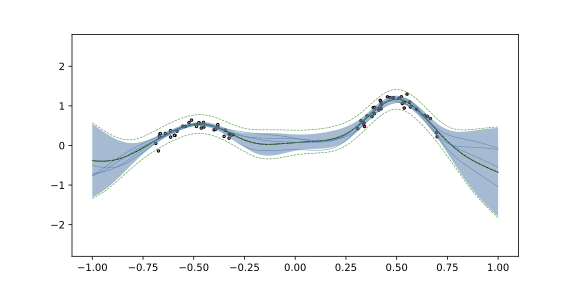

# Introduction

Uncertainty Neural Networks in [JAX](https://docs.jax.dev/en/latest/index.html).

Implementation of Function-Space Variational Inference (FSVI) for Bayesian deep neural
networks. Heavily inspired by [Rudner et al. (2023)](https://arxiv.org/abs/2312.17199v1). The
structure of the codebase is also inspired in places by the [GPFlow](https://github.com/GPflow/GPflow)
project.

## How it works
There are two key components:

- A stochastic neural network i.e. one in which the weights are random variables and the
learnable parameters describe the distribution(s) from which the weights are drawn rather than
the weights themselves. Networks constructed in such a way describe a distribution over
functions and thus allows the model to express epistemic uncertainty.

- An ELBO loss function that is composed of: 

    - A negative log-likelihood term that measures the likelihood of observing the target data
    given the model's predictions; and,

    - A KL divergence term that measures the divergence between a variational approximation of
    the posterior distribution over functions and some prior distribution at points sampled from the input space.

## Examples
### Regression 1D

### Classification 2D

### Sequential Learning

